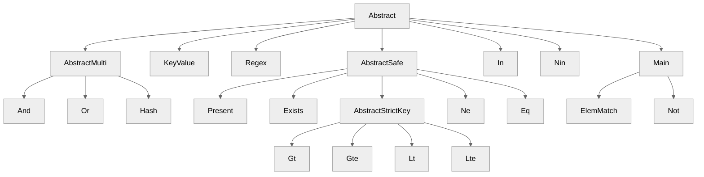

# Matcher classes inheritance diagram

```mermaid
---
config:
  theme: neutral
  look: classic
---
graph TD
  A[Abstract]
  B[Main]
  C[AbstractMulti]
  D[AbstractSafe]
  E[Eq]
  F[Hash]
  G[KeyValue]
  H[ElemMatch]
  I[And]
  J[Or]
  K[Regex]
  L[Present]
  M[Exists]
  N[Not]
  O[Ne]
  P[AbstractStrictKey]
  Q[Gt]
  R[Gte]
  S[Lt]
  T[Lte]
  U[In]
  V[Nin]
A --> C
A --> G
A --> K
A --> D
A --> U
A --> V
A --> B
B --> H
B --> N
C --> I
C --> J
C --> F
D --> L
D --> M
D --> P
D --> O
D --> E
P --> Q
P --> R
P --> S
P --> T
```