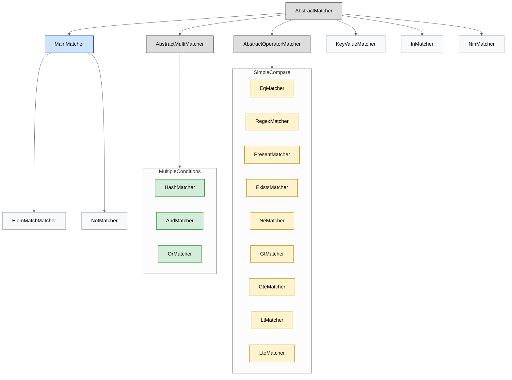
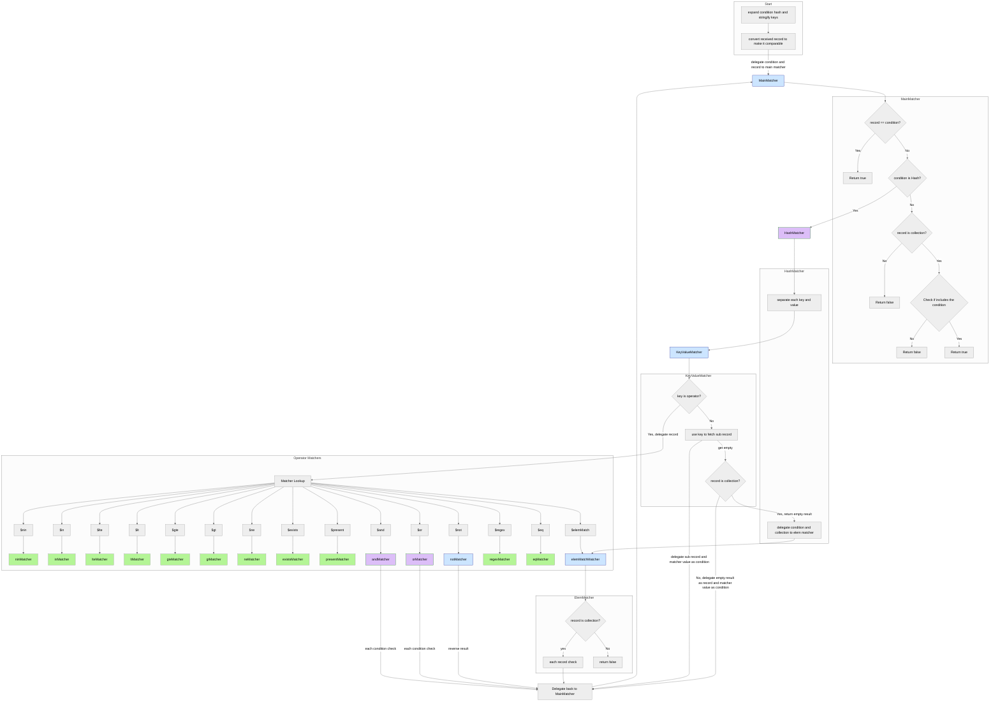

# Matcher classes inheritance diagram

```mermaid
---
config:
  theme: neutral
  look: classic
---

graph TD
  %% style blocks
  classDef abstract fill:#ddd,stroke:#333,stroke-width:1px,color:#000;
  classDef main fill:#cce5ff,stroke:#339,stroke-width:1px;
  classDef multi fill:#d4edda,stroke:#282,stroke-width:1px;
  classDef operator fill:#fff3cd,stroke:#aa8800,stroke-width:1px;
  classDef leaf fill:#f8f9fa,stroke:#999,stroke-width:1px;

  %% Abstract base classes
  A[AbstractMatcher]
  C[AbstractMultiMatcher]
  D[AbstractOperatorMatcher]

  subgraph MultipleConditions
    F[HashMatcher]
    I[AndMatcher]
    J[OrMatcher]
  end

  subgraph SimpleCompare
    E[EqMatcher]
    K[RegexMatcher]
    L[PresentMatcher]
    M[ExistsMatcher]
    O[NeMatcher]
    Q[GtMatcher]
    R[GteMatcher]
    S[LtMatcher]
    T[LteMatcher]
  end

  A --> B[MainMatcher]
  A --> G[KeyValueMatcher]
  A --> U[InMatcher]
  A --> V[NinMatcher]
  A --> C --> MultipleConditions
  A --> D --> SimpleCompare
  B --> H[ElemMatchMatcher]
  B --> N[NotMatcher]

  %% Apply classes
  class A,C,D abstract;
  class B main;
  class F,I,J multi;
  class E,K,L,M,O,Q,R,S,T operator;
  class G,U,V,H,N leaf;
```

Logic fLow

```mermaid
---
config:
  theme: neutral
  look: classic
---

graph TD
  classDef logicFlow fill:#cce5ff,stroke:#339,stroke-width:1px;
  classDef multiCondition fill:#dcbef8,stroke:#282,stroke-width:1px;
  classDef operator fill:#fff3cd,stroke:#aa8800,stroke-width:1px;
  classDef leaf fill:#b4f596,stroke:#999,stroke-width:1px;

  subgraph Start
    STA[expand condition hash and stringify keys] -->
    STB[convert received record to make it comparable]
  end
  STB -- delegate condition and record to main matcher --> A
    A[MainMatcher]:::logicFlow --> A1{record == condition?}
  subgraph MainMatcher
    A1 -- No --> A2{condition is Hash?}
    A2 -- No --> A3{record is collection?}
    A3 -- Yes --> A4{Check if includes the condition}
    A3 -- No --> A5[Return false]
    A4 -- Yes --> A41[Return true]
    A4 -- No --> A42[Return false]
    A1 -- Yes --> A11[Return true]
  end

  A2 -- Yes --> B[HashMatcher]:::multiCondition

  subgraph HashMatcher
    HMA[separate each key and value]
    HMB[delegate condition and collection to elem matcher]
  end
  HMB --> D1
  B --> HMA --> C[KeyValueMatcher]:::logicFlow
  C --> C1{key is operator?}
  subgraph KeyValueMatcher
    C1 -- No --> C3[use key to fetch sub record]
    C3 -- get empty --> C2{record is collection?}
  end
  C2 -- Yes, return empty result --> HMB
  C3 -- delegate sub record and matcher value as condition--> C4
  C2 -- No, delegate empty result as record and matcher value as condition --> C4

  C1 -- Yes, delegate record --> S[Matcher Lookup]
  C4[Delegate back to MainMatcher]
  D1 --> ELMA
  ELMB --> C4
  E1 & F1 -- each condition check--> C4
  R1 -- reverse result --> C4
  C4 --> A

  subgraph Operator Matchers
    S --> D[$elemMatch] --> D1[elemMatchMatcher]:::logicFlow
    S --> G[$eq] --> G1[eqMatcher]:::leaf
    S --> H[$regex] --> H1[regexMatcher]:::leaf
    S --> R[$not] --> R1[notMatcher]:::logicFlow
    S --> F[$or] --> F1[orMatcher]:::multiCondition
    S --> E[$and] --> E1[andMatcher]:::multiCondition
    S --> I[$present] --> I1[presentMatcher]:::leaf
    S --> J[$exists] --> J1[existsMatcher]:::leaf
    S --> K[$ne] --> K1[neMatcher]:::leaf
    S --> L[$gt] --> L1[gtMatcher]:::leaf
    S --> M[$gte] --> M1[gteMatcher]:::leaf
    S --> N[$lt] --> N1[ltMatcher]:::leaf
    S --> O[$lte] --> O1[lteMatcher]:::leaf
    S --> P[$in] --> P1[inMatcher]:::leaf
    S --> Q[$nin] --> Q1[ninMatcher]:::leaf
  end

  subgraph ElemMatcher
    ELMA{record is collection?}
    ELMA -- No --> ELMF[return false]
    ELMA -- yes --> ELMB[each record check]
  end

  class A,C logicFlow;
  class B multiCondition;


```